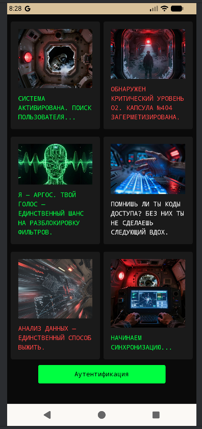
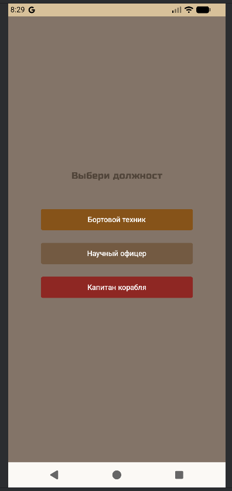
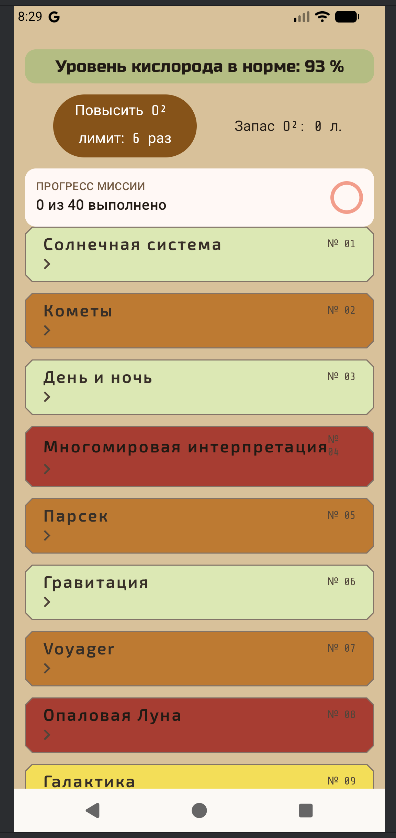
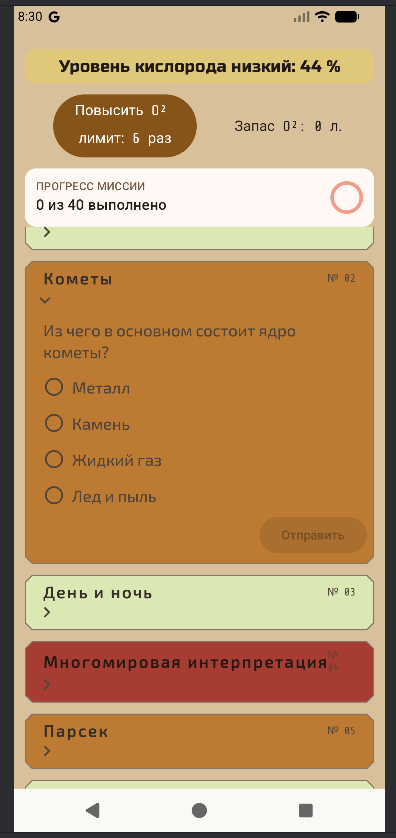
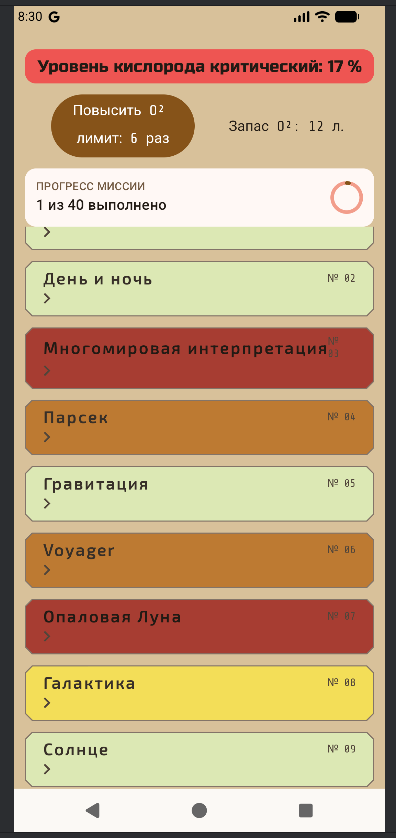
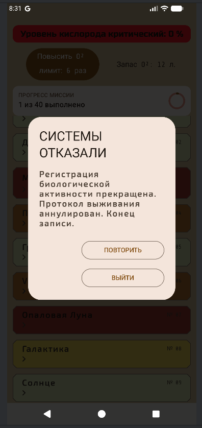

# 🚀 Space Waypoint: Oxygen Quiz

**Space Waypoint** — это динамичная викторина в сеттинге выживания в открытом космосе.  
Ваш главный враг — не сложные вопросы, а время. Кислород уходит с каждой секундой!

---

## 📸 Скриншоты
<p align="center">
  
  
  
  
   
  
</p>


---

## 🛠 Особенности игры

- **Механика кислорода:** Запас воздуха тает в реальном времени. Правильные ответы пополняют резерв, ошибки — ускоряют гибель.
- **Минималистичный сюжет:** Погружение через интерактивный комикс на старте.
- **Три уровня сложности:**
    - **EASY:** Утечка 1% каждые 2 сек. Нет штрафа за ошибки.
    - **NORMAL:** Утечка 1% в сек. Штраф равен ценности вопроса.
    - **HARD:** Утечка 1% каждые 0.8 сек. Повышенная сложность и время блокировки задач.
- **Аудио-сопровождение:** Динамическая музыка и звуковые эффекты, реагирующие на уровень кислорода.

---

## 💻 Технологии

- **Language:** Kotlin
- **UI:** Jetpack Compose
- **Architecture:** MVVM (ViewModel, StateFlow)
- **Navigation:** Jetpack Navigation
- **Asynchrony:** Kotlin Coroutines

---

## 🚀 Как запустить

1. Клонируйте репозиторий:
   ```bash
   git clone git@github.com:bobbyFishe/SpaceWayPoint.git

## 📲 Скачать
Вы можете скачать последнюю версию игры (APK) в разделе [Releases](https://github.com).

